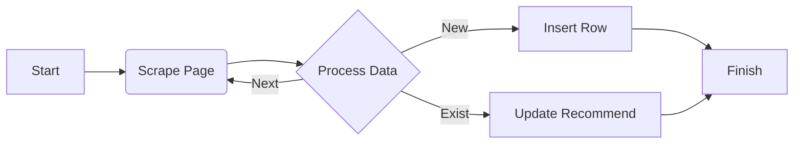

# DC Inside Gallery Scraper

이 프로젝트는 구글 스프레드시트(Google Sheets)와 연동하여 DC Inside 갤러리의 특정 조건(추천수 100 이상)을 만족하는 게시물을 자동으로 수집하는 **Google Apps Script**입니다.

## 기능

- 지정된 갤러리(트릭컬 갤러리/창작 탭)의 개념글을 크롤링합니다.
- 사용자가 설정한 페이지 범위(기본 1~30페이지)를 순회합니다.
- 추천수가 100개 이상인 게시물만 필터링하여 시트에 저장합니다.
- 중복 실행 방지 기능은 없으므로, 실행 시마다 새로운 행에 추가됩니다.

## 사용 방법

1. **새 스프레드시트 생성**
   - [Google Sheets](https://docs.google.com/spreadsheets)에서 새 시트를 만듭니다.

2. **Apps Script 열기**
   - 상단 메뉴에서 `확장 프로그램` > `Apps Script`를 선택합니다.

3. **코드 붙여넣기**
   - `Code.gs` 파일의 내용을 모두 복사하여 스크립트 편집기의 `Code.gs` 파일에 붙여넣습니다 (기존 내용은 지우세요).
   - `Ctrl + S` 키를 눌러 저장합니다. 프로젝트 이름은 원하는 대로 정하세요 (예: `DC Scraper`).

4. **스크립트 실행**
   - 스프레드시트 화면으로 돌아와서 페이지를 **새로고침**합니다.
   - 상단 메뉴바에 `DC Inside 크롤링`이라는 새로운 메뉴가 생긴 것을 확인합니다. (나타나지 않으면 잠시 기다리거나 다시 새로고침)
   - `DC Inside 크롤링` > `스크랩 시작`을 클릭합니다.

5. **권한 허용**
   - 처음 실행 시 권한 승인이 필요합니다.
   - `권한 검토` > `계정 선택` > `고급` > `(프로젝트 이름)으로 이동` > `허용`을 순서대로 클릭합니다.
   - **경고 화면이 나와도 안전하므로 진행하시면 됩니다.** (여러분이 직접 작성한 코드이므로 안전합니다)

6. **결과 확인**
   - 스크립트가 실행되면 잠시 후 시트에 게시물 목록이 자동으로 채워집니다.

## 설정 변경

스크립트 상단의 `CONFIG` 변수를 수정하여 검색 조건을 변경할 수 있습니다.

```javascript
const CONFIG = {
  GALLERY_ID: 'rollthechess', // 말머리 ID 확인 필요
  SEARCH_HEAD: 40,            // 창작 탭
  LIST_NUM: 100,              
  START_PAGE: 1,              
  MAX_PAGE: 10,               
  MIN_RECOMMEND: 100,         
  BASE_URL: 'https://gall.dcinside.com/mgallery/board/lists/' // 일반/마이너 갤러리 구분 시 수정
};
```

## 동작 구조 (Flowchart)



